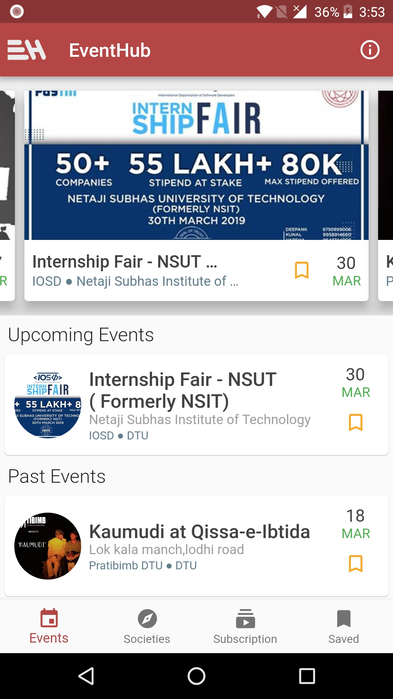
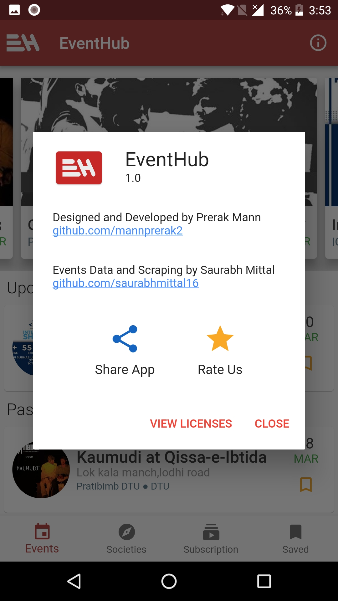
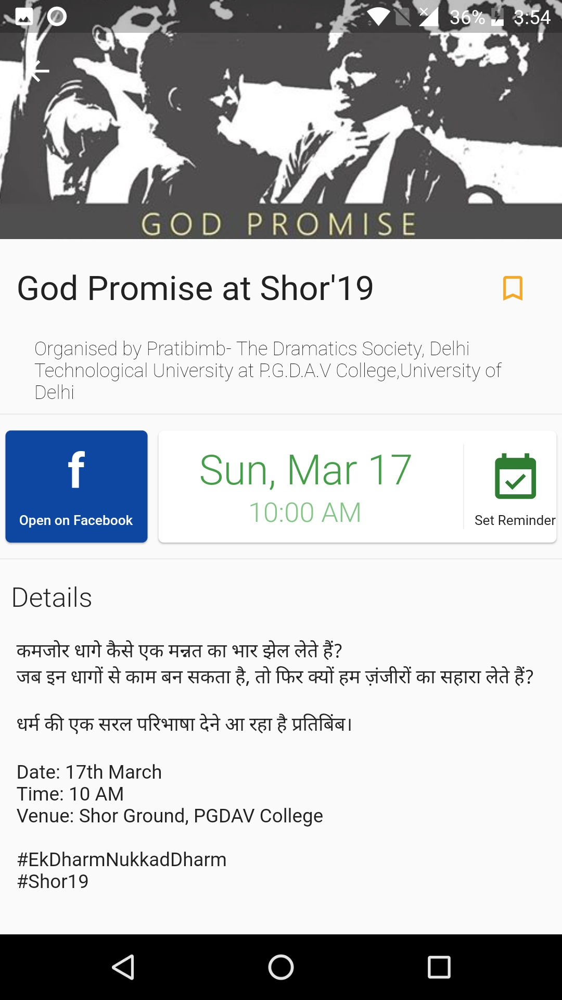
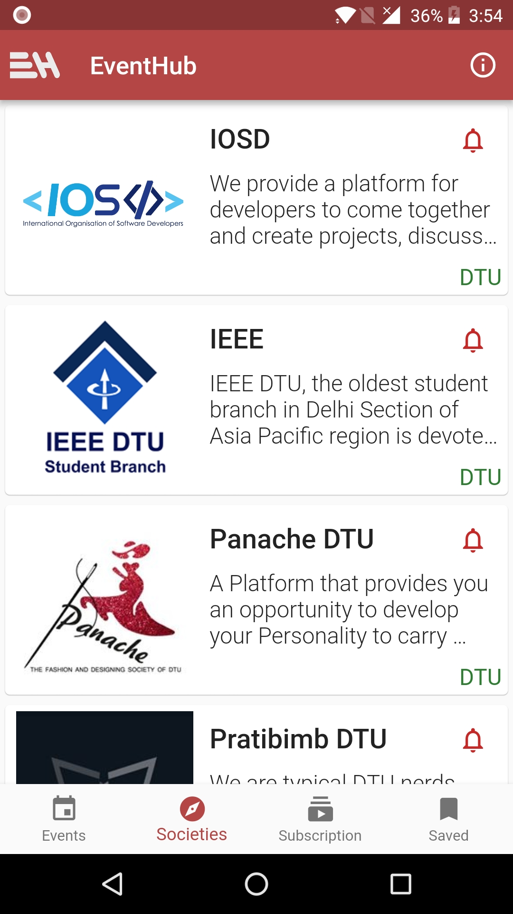
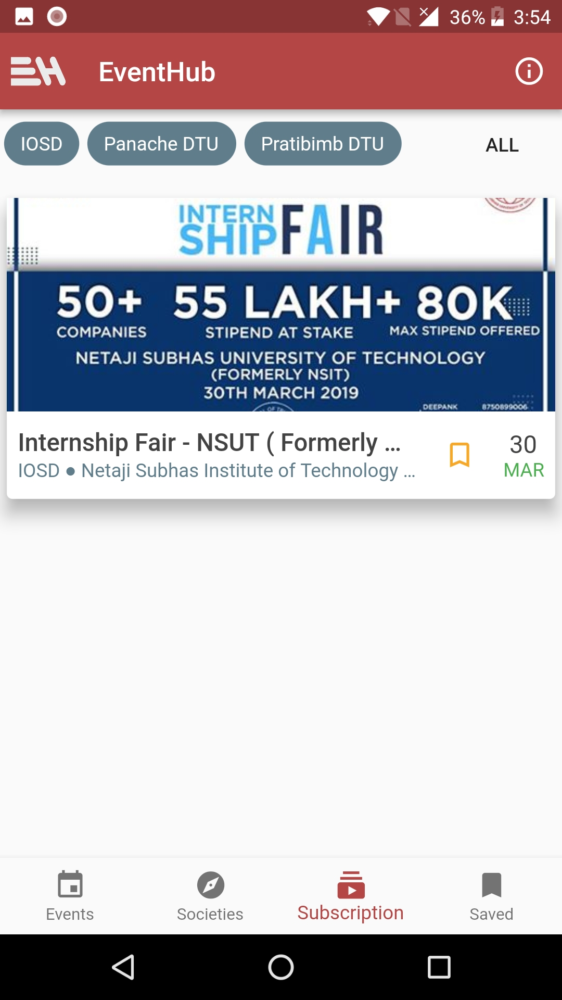
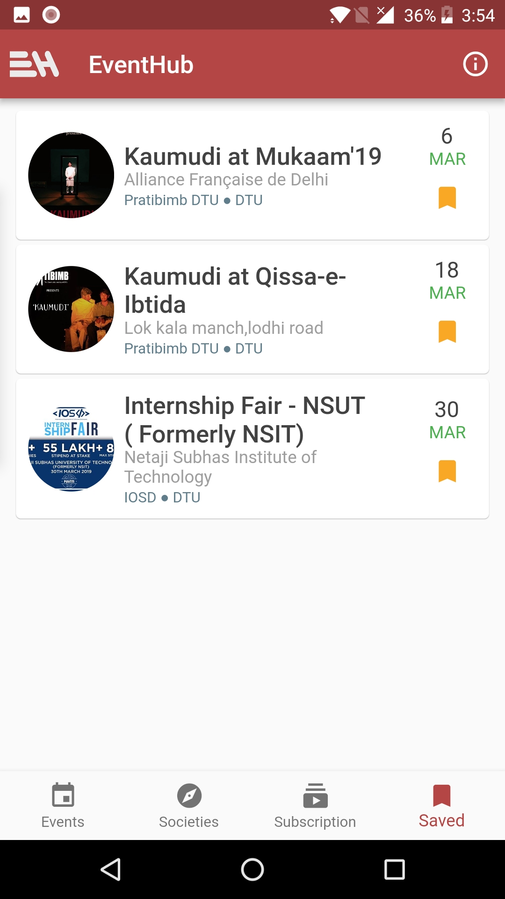

# EventHub
View Events in Colleges (DTU), Made with Flutter

<a href='https://play.google.com/store/apps/details?id=com.pkmnapps.eventsflutter'></a>
<h3>View online <a href="https://mannprerak2.github.io/event_hub_flutter/">mannprerak2.github.io/event_hub_flutter</a></h3>

### Screenshots

|| | |
---
| |  | |

### Base Idea
```
A Firebase app for 
    -finding events in institutes around you,
    -following organisers and institutes for events, 
```
### Folder Structure
* blocs -> has buisness logic components
* models -> has response data models which we will recieve
* resources -> has repository classes and network call implemented classes
* ui
    * tabs ->  user screens
    * tiles -> reusable tiles

## Caching and Storage
* GlobalBloc level:
    * eventtab list stored in eventListCache
    * eventpage documents stored in eventPageCache
* SQL
    * Stored bookmarks in SQLite 
        > Converted documentSnapshot to map, with *documentId* mapped as *id* 

## App Flow

```
1.Start -> SplashLoaderScreen
2.SplashScreen
    Login
    if(success) // tokens are of atleast 2 month validity
        yes -> 'MainScreen'
        no -> show error and try again button
                if(success) // onclick login button
                    yes -> MainScreen
3.MainScreen
    layout: Tabs as in screens section ^^
```
